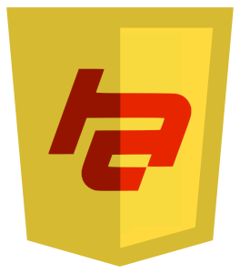

scalajs-hyperapp
================
[](https://travis-ci.org/Sorixelle/scalajs-hyperapp)
[](https://maven-badges.herokuapp.com/maven-central/cf.srxl/scalajs-hyperapp)

A [Scala.js](https://www.scala-js.org/) facade for [Hyperapp](https://hyperapp.js.org), a JavaScript micro-framework for
building web applications.

## Getting Started
First, enable the scalajs-bundler plugin by following [these instructions](https://scalacenter.github.io/scalajs-bundler/getting-started.html).
Then, add the following dependency to your `build.sbt`:
```scala
libraryDependencies += "cf.srxl" %%% "scalajs-hyperapp" % "1.0.0"
```

### Basic App
Below is the same counter application found in the Hyperapp readme, written with Scala.js.
```scala
import org.scalajs.dom.document

import cf.srxl.hyperapp.Actions
import cf.srxl.hyperapp.DSL._

object CounterApp {
  def main(args: Array[String]): Unit = {
    val state: State = Map(
      "count" -> 0
    )

    val actions = Actions(
      "down" ==> ((value: Int) => state => state.int("count").map(c => Map("count" -> (c - value)))),
      "up" ==> ((value: Int) => state => state.int("count").map(c => Map("count" -> (c + value))))
    )

    val view: View = (state, actions) =>
      <("div", ^(),
        <("h1", ^(), state.int("count").get),
        <("button", ^("onclick" -> (() => actions.action("down").get(1))), "-"),
        <("button", ^("onclick" -> (() => actions.action("up").get(1))), "+")
      )

    app(state, actions, view, document.body)
  }
}
```

## Reference
### Imports
`cf.srxl.hyperapp.DSL._` contains many useful functions and implicits to help build Hyperapp apps. You'll almost
certainly want to import this. Everything else can be imported as necessary.

### State
A state object is a simple `Map[String, js.Any]` (or the `State` type alias from the hyperapp package object).
```scala
val state: State = Map(
  "key" -> "value"
)
```
To access values from a state object, you can use the methods defined in `DSL.StateOps` to easily get the types you
want.

#### Nested State
When using nested state, make sure to import `scala.scalajs.js.JSConverters._` and call `toJSDictionary` on any `Map`s
in the state. Alternatively, you can use the `::>` operator from `DSL` to have the conversion done for you.
```scala
val state: State = Map(
  "nested" ::> (
    "key" -> "value"
  )
)
```

### Actions
Action objects are created with the `Actions` class. There are 4 different entry types you can have in a state object:
- Simple actions (`-->`)
- Stateful actions (`==>`)
- Asynchronous actions (`=/>`)
- Action scopes (`:>`)

As an example, this object in JavaScript:
```javascript
const actions = {
  scope: {
    action1: value => ({ value1: value })
  },
  action2: value => state => ({ value2: state.value2 + value }),
  action3: value => (state, actions) => { doSomething(); actions.action2(value) }
}
```
would look like this in Scala (the `Int` types on the functions are as an example):
```scala
val actions = Actions(
  "scope" :> (
    "action1" --> ((value: Int) => Map("value1" -> value))
  ),
  "action2" ==> ((value: Int) => state => state.int("value2").map(v => Map("value2" -> (v + value)))),
  "action3" =/> ((value: Int) => (state, actions) => { doSomething(); actions.action("action2").get(value) })
)
```

#### Received Actions
Actions received from functions such as the view function or an async action are *not* `Actions`, rather they are
`WiredActions`. You can access actions from a `WiredAction` using `actions`, and scopes with `scope`. Both methods
return `Options`, so you can use them in for-comprehensions like so:
```scala
for {
  level1 <- actions.scope("level1")
  level2 <- level1.scope("level2")
  action <- level2.action("action")
} yield action("value")
```
Just like in regular Hyperapp, the `app` method returns the `WiredActions`, so you can use it to call actions from
wherever you want.

### View
A view function takes a `State` and an `Actions`, and returns a `ViewNode`. The `View` type alias describes this
function. Instead of manually creating ViewNodes, you can use the `<` and `^` functions from `DSL` to easily create
nodes.
```scala
<("tagName", ^("attribute" -> "value"), "children")
```
An example of a view function:
```scala
val view: View = (state, actions) =>
  <("div", ^(),
    <("h1", ^(), "Hello, World!"),
    <("button", ^("onclick" -> (() => doSomething())), "Click Me!")
  )
```

### Components
The `<` function can also accept a component as it's first parameter. There are 4 different types of components:
- `Component` (`props => ViewNode`)
- `ComponentWithChildren` (`(props, children) => ViewNode`)
- `LazyComponent` (`props => (state, actions) => ViewNode`)
- `LazyComponentWithChildren` (`(props, children) => (state, actions) => ViewNode`)

The shape of the props object is the same as a state object, so you can use all the methods in `DSL.StateOps` on a props
object in the same way you would on a state object.

## Contributing
If you have a feature you want added, feel free to open an issue, or a PR if you're feeling kind enough! Make sure that
both the unit tests in `/src/test/scala` and the integration tests in `/integration-tests` are passing before you open
a PR. Feel free to add more tests if you feel they're necessary, too.

## Credits
- [Jorge Bucaran (jorgebucaran)](https://github.com/jorgebucaran) for creating Hyperapp
- The [gwen-interpreter team](https://gwen-interpreter.github.io/) for creating Gwen and the Gwen-Web engine used in
  integration testing
- The [Scala.js gitter](https://gitter.im/scala-js/scala-js) and [Hyperapp Slack](https://hyperappjs.herokuapp.com/) for
  helping me out with some issues (feel free to pop by and say hi! :))

## License
scalajs-hyperapp is licensed under the
[BSD 3-Clause License](https://github.com/Sorixelle/scalajs-hyperapp/blob/master/LICENSE). Hyperapp is licensed under
the [MIT License](https://github.com/jorgebucaran/hyperapp/blob/master/LICENSE.md).
